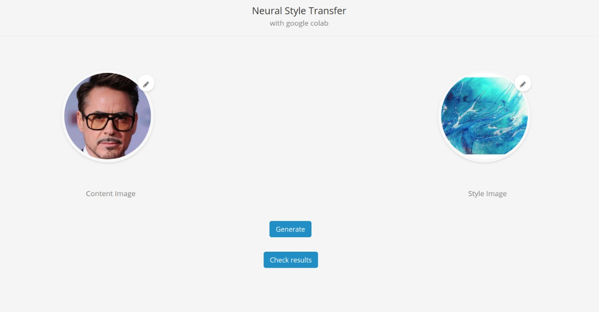
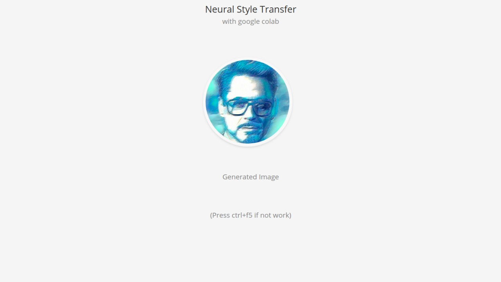

# Neural Style Transfer with Google Colab.

Neural Style Transfer runs on Google Colab with power of GPU and have a shareable web page.

## Neural Style Transfer.

Neural style transfer is a technique which takes images two images, a *content* image and a *style* image and generates an output image which looks like the content image, but is “painted” in the style of the style image.

Not everyone can make good paintings, but with the recent advances in technologies like style transfer, everyone can experience the joy of creating an artistic masterpiece.

Style Transfer not only works on images, but on captured and live videos too, this ability opens various opportunities in fields such as design, content generation etc.

Style Transfer has also crawled its way into the commercial art world. ([Christie’s featured AI artwork](https://www.christies.com/features/A-collaboration-between-two-artists-one-human-one-a-machine-9332-1.aspx) was for more than $430,000.)

Style Transfer not only makes the work simpler, but inspires a lot of people to explore innovative artistic styles.( https://nypost.com/2020/07/02/artist-uses-ai-to-create-stunning-portraits-of-historical-figures/)

> Here are some ways in which style transfer is shaping our future:

- Photo and video editors
- Artist-Community engagement
- Commercial art
- Gaming
- Virtual Reality

Examples:

- Page 1

- Page 2

> Requirements

- Google Colab
- Pytorch
- Flask
- Pyngrok
- PIL

> Steps to do

- Put html, css and js files in your drive in StyleTransfer folder.

- Login on ngrok get your authtoken.

- Make sure your run-time is on GPU.

- Run all cells in notebook.

- Mount your drive using authentication.

- Put your ngrok authtoken.

  > ! ngrok authtoken xxxxxxx

- Copy public url from ngrok and open it.

- Upload your desired content and style image.

- See progress in notebook.

- When training is done open see results.

- If you can't get your generated image hard refresh(ctrl+f5).

- If your server stops and want to run it again first run ngrok cell to make public url then flask cell.

> Conclusion

- Learn how to do Neural Style Transfer in Pytorch.
- This project can get you temporary public url so that you can share it.
- If you don't have GPU and want to deploy ML model with power of GPU this can help.

> If you want Tensorflow version:

[Neural Style Transfer in Tensorflow](https://github.com/eshna)